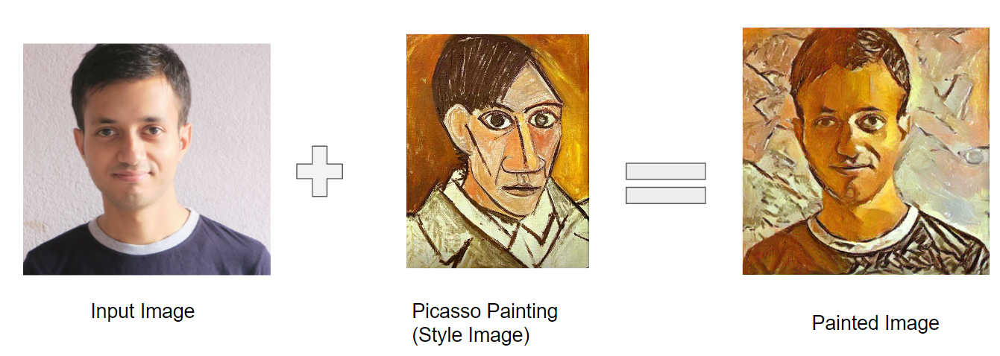

# Neural Style Transfer Implementation - [Medium Post](https://susant.medium.com/basic-intuition-on-neural-style-transfer-idea-c5ac179d1530)

The concept of style transfer is to transfer a style or texture to an input image, and the method to achieve a style-transferred image with a deep neural network called Neural Style Transfer.
Actually, it is slightly different how the neural networks work as we update the pixels of an image( Weights to be updated of a result image) and the frozen weights of the Pre-Trained Network. We keep updating the final image pixels according to loss until it is desired output i.e minimum loss.

Pretrained Network (VGG, ResNet)is used to extract the features from the content image and style image, and some mechanism is used to update the pixels of the style-transferred image i.e. final output.
That’s why only single style image to be transferred on corresponding single style image and not dataset used. In fact, one-to-one correspondence between style and content image.

## Components:
* Pretrained CNN Models for features extraction
* Content Image: An image where we want to transfer style 
* Style Image: An image which style is to be transferred
* Generated Image: the image that contains the final result(pixels i.e weights)

### STEPS:
1. Compute features using pre-trained models like VGG, ResNet.
2. Compute content loss and style loss
3. Compute total combine loss.
4. Backpropagate Gradient to update generated image weights pixels, while pretrained models weights were freezed.

### Content Loss

**Why only Last layer?**

In deep convolutional layers, different layers learn different features.
Previous convolutional layers learn features such as edges and simple textures, whereas later convolutional layers learn more complex texures and patterns like objects or part of objects.
So, we need main components like object from the content image and we extract from last layer only.

### Computation Of Gram Matrix
Finding correlation between features of style image and generated image. The gram matrix is used to capture the style.The principle behind this is if two features are very close to each other then the value should be large. 
So, it helps to match the distribution of the style image and generated image.

### Style Loss
Then, Compute style loss in all layers to preserve the every details in generated image.

### Total Loss And Backprogation
Finally, total loss is calculated as weighted loss = 𝜶 x Content Loss + 𝝱 x Style Loss .
Our main job is to minimize this loss using some optimizer like Adam to generated image which have both details of content image and style image.
The main thing is there is backpropagation of the gradient to update the weights of the generated image i.e pixels value which include the details of both content and style image.

# My Own Painting Generated :smile: :

